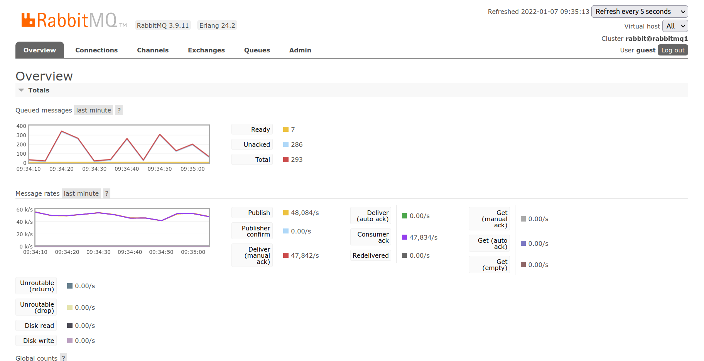
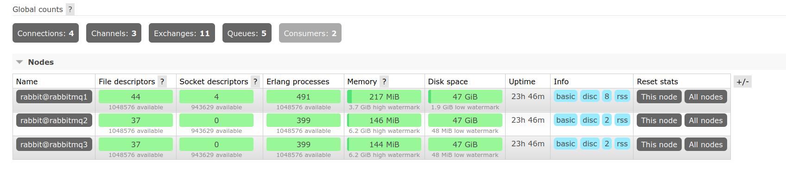
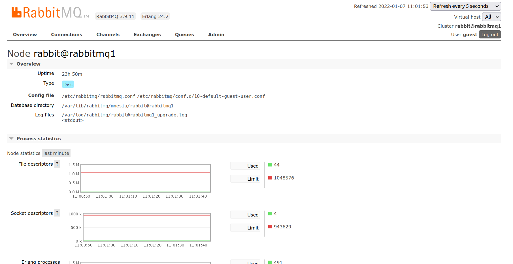

# Exercice 12 - Monitoring

## Objectifs

Cet exercice a pour objectifs :
* D'explorer les métriques mise à disposition par RabbitMQ
* De monitorer notre Cluster RabbitMQ avec Prometheus et Grafana  

## Explorer les métriques de monitoring

* RabbitMQ fournit des métriques qui sont afficées dans l'UI 

* On peut voir dans cette première partie :
    * le nombre de message dans les queues par état
    * le taux de message envoyé par seconde
* En descendant un peu plus bas dans la page on obtient des informations sur les noeuds et l'utilisation des ressources de chacun de nos noeuds : 

* On voit alors :
    * un compteur global du nombre de queue, de connexions, de channels, d'exchanges et de consommateurs
    * la liste des noeuds avec l'utilisation des ressources principales de chaque noeud

* En cliquant sur le nom d'un noeud, on obtient des informations de monitoring plus détaillées sur celui-ci : 


* Ces informations de monitoring nous permettent d'avoir déjà de nombreuses informations sous forme visuelle pour surveiller notre cluster.
* L'ensemble des métriques sont également accessible via l'[API rest de Monitoring] (https://www.rabbitmq.com/monitoring.html#rabbitmq-metrics)

## Monitorer son cluster RabbitMQ avec Prometheus et Grafana

* [Prometheus](https://prometheus.io/) est un outil open source qui permet de stocker des métriques de monitoring. [Grafana](https://grafana.com/) est un outil open source qui permet d'afficher et de créer des tableaux de bords avec des graphiques. Les deux sont souvent utilisés ensemble pour monitorer des solutions de manière souple et dynamique afin de remplacer des systèmes vieillissant de monitoring de type Zabbix ou Nagios. 
* Pour pouvoir utiliser Prometheus avec RabbitMQ il est nécessaire d'activer le plugin *rabbitmq_prometheus* qui se chargera de récupérer les données de monitoring, de les mettre dans le bon format et de les transmettre à Prometheus. 
* Nous avons également besoin d'un cluster RabbitMQ et des metriques à exploiter. Pour cela nous utilisons le [docker-compose.yaml fourni par RabbitMQ](https://github.com/rabbitmq/rabbitmq-server/blob/master/deps/rabbitmq_prometheus/docker/docker-compose-overview.yml) que nous téléchargeons et lançons avec la commande : 
```
docker-compose up -d
```
* Puis nous lançons un conteneur qui contient grafana à partir du deuxième [docker-compose.yaml fourni par RabbitMQ](https://github.com/rabbitmq/rabbitmq-server/blob/master/deps/rabbitmq_prometheus/docker/docker-compose-metrics.yml) que nous téléchargeons également et lançons avec la même commande.
* Enfin nous accédons à Grafana sur l'URL : http://localhost:3000 et obtenons une tableau de bord ressemblant à : 


* Pour présenter ce tableau de bord voici les différentes parties qui le compose : 
    * Le bandeau en haut représente les données de santé d'un seul cluster que l'on peut choisir (on peut donc monitorer plusieurs clusters dans le même tableau de bord). 
    
    Les trois couleurs utilisées signifient : 
        * vert : la value est dans le rang correct
        * bleu : sous utilisation de la ressource ou certaines dégradations sont constaté
        * rouge : la valeur de la métric est en dessous ou au dessus de ce qui est considéré comme correct
    * la seconde partie représente des métriques qui sont présentées sous forme de graphiques avec des valeurs qui change tout le temps. Les données sont basées sur une échelle temporelle permettant d'avoir en quasi temps réel l'état de son cluster (moins la latence réseau pour la transmission des métriques)
    
    Dans ces graphiques chaque couleur est associé à un noeud du cluster et les valeurs de rang sont prédéfinies avec des valeurs acceptable.

* Il est bien sur possible de [configurer Prometheus](https://prometheus.io/docs/prometheus/latest/configuration/configuration/) et de [créer ses propres tableaux de bord dans Grafana ou d'utiliser des tableaux de bords prédéfinis différents](https://grafana.com/docs/)

-> Il ne vous reste plus qu'à définir les éléments spécifiques à votre contexte que vous souhaitez monitorer, à choisir votre outil de monitoring et à mettre en place le monitoring

